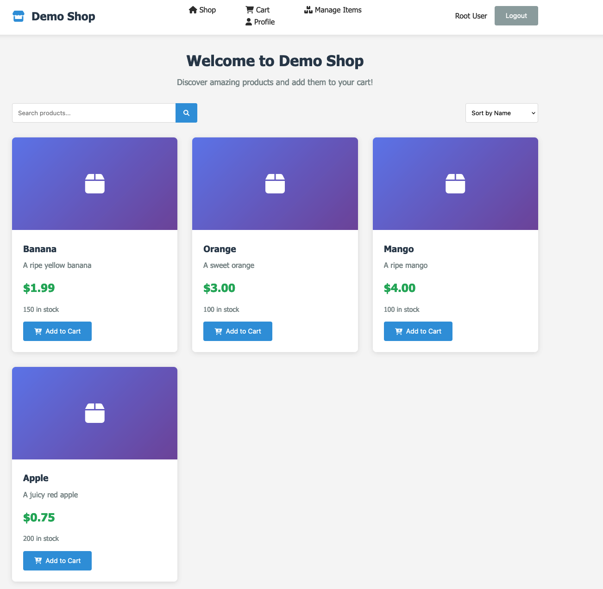
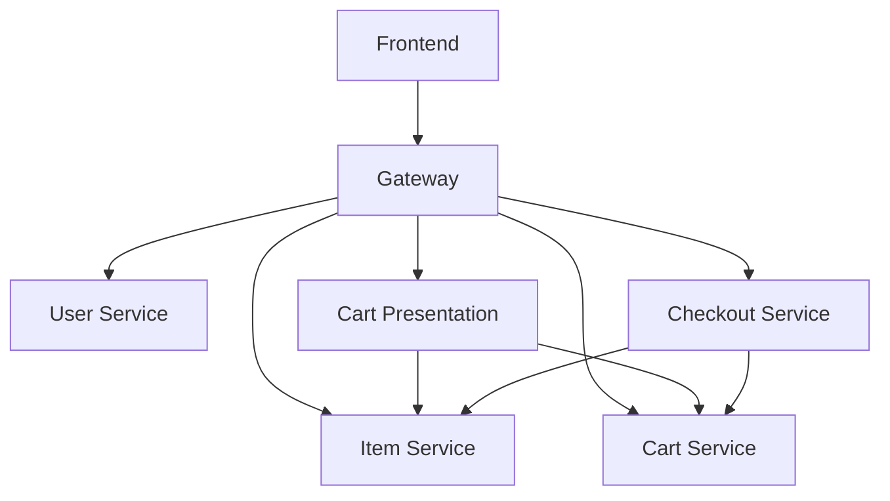

# demo-shop

A simple Go based demo microservice application.

## What is this?

This demo microservice application is designed to showcase the capabilities of a microservices architecture using Go. It demonstrates how to build cloud native applications with a focus on scalability, resilience, and maintainability. A key aspect of this application is to demonstrate how to integrate tracing and monitoring. Each microservice is designed to be independently deployable and scalable. The application is built around the following services:

| Service Name | Description |
|--------------|-------------|
| User Service | Manages user accounts |
| Item Service | Handles product catalog and inventory |
| Cart Service | Manages shopping cart functionality |
| Cart Presentation Service | Renders the cart details as single JSON object (references to items are resolved) |
| Checkout Service | Manages the checkout process |
| Gateway Service | Acts as an authentication and authorization proxy for the microservices |
| Frontend Service | Provides the user interface for the application |

### Flow Diagram

## Local Development

### Requirements

- Podman >= 5.5.1
- Go >= 1.24

### How to start

To simplify the process of startup for all microservices, a `Makefile` is provided. You can use the following commands to start the application:

| Command       | Description                     |
|---------------|---------------------------------|
| `make run`    | Start all services in the foreground |
| `make rund`   | Start all services in detached mode |
| `make down`   | Stop all services |
| `make test`   | Execute unit tests with coverage |
| `make test-short`   | Execute unit tests in short mode |
| `make lint`   | Run code linters |
| `make clean`    | Format code with gofmt |
| `make install-tools`  | Install development tools |
| `make help`  | Print help information |
