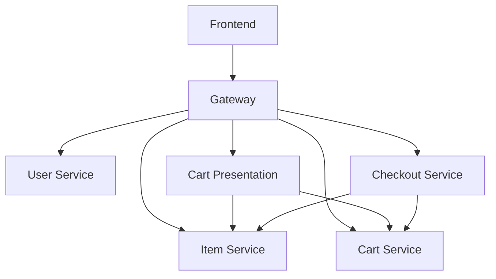

# demo-shop

A simple Go based demo microservice application.

## Requirements

- Podman >= 5.5.1

## Quick Start

### Start stack

`make run`

or

`make rund`

to run the stack in detached mode

## Flow Diagram

